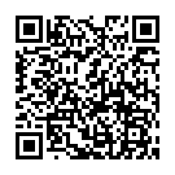

 
 ##  PROJECT
  - 챗봇을 통해 옷과 날씨 정보를 한 번에 확인하세요.
  - 이 프로젝트는 line api, 대한민국 기상청 동네예보 api를 사용합니다.

 ##  About project
  - 날씨 정보로 적당한 옷을 찾기란 생각보다 꽤 헷갈립니다. 날씨와 그에 따라 추천되는 옷을 한번에 확인하세요

  - 챗봇에 지역을 입력하면 날씨와 그에 맞는 옷차림을 제안
  
  - 챗봇 사용시 반드시 '시작' 이라는 메세지를 보내야함

## GET STARTED
 1. 라인을 설치하고 회원가입을 진행하세요
 
 - 이 QR코드로 친구추가를 진행할 수 있습니다.

## Built with
  - [node.js] https://nodejs.org/en/
  - [line api] https://developers.line.biz/en/
  - [대한민국 기상청 동네예보 api] https://data.go.kr/data/15057682/openapi.do

  
## Installation
  - Get a free API Key at https://developers.line.biz/en/
  
  - Get a free API Key at https://data.go.kr/data/15057682/openapi.do
  
  - Clone the repository

     `git clone http://khuhub.khu.ac.kr/2019102190/weather_chatbot.git`

  - Install NPM package
  
      `npm install express`
    
  - Enter your API in app.js
      
      `const TOKEN = 'ENTER YOURS'`

      `var WEATHER_URL = ... serviceKey='ENTER YOURS'`

      `const domain = "Your Domain"`

## Usage
    -'시작'을 누르면 어떻게 지역을 입력할지 챗봇이 알려줍니다,
    - 입력에 따라 챗봇이 그 지역의 날씨와 옷에 대한 정보를 알려줍니다.
 

## 라이센스
 MIT License

Copyright (c) [2020] [Shin Jeong A]

Permission is hereby granted, free of charge, to any person obtaining a copy
of this software and associated documentation files (the "Software"), to deal
in the Software without restriction, including without limitation the rights
to use, copy, modify, merge, publish, distribute, sublicense, and/or sell
copies of the Software, and to permit persons to whom the Software is
furnished to do so, subject to the following conditions:

The above copyright notice and this permission notice shall be included in all
copies or substantial portions of the Software.

THE SOFTWARE IS PROVIDED "AS IS", WITHOUT WARRANTY OF ANY KIND, EXPRESS OR
IMPLIED, INCLUDING BUT NOT LIMITED TO THE WARRANTIES OF MERCHANTABILITY,
FITNESS FOR A PARTICULAR PURPOSE AND NONINFRINGEMENT. IN NO EVENT SHALL THE
AUTHORS OR COPYRIGHT HOLDERS BE LIABLE FOR ANY CLAIM, DAMAGES OR OTHER
LIABILITY, WHETHER IN AN ACTION OF CONTRACT, TORT OR OTHERWISE, ARISING FROM,
OUT OF OR IN CONNECTION WITH THE SOFTWARE OR THE USE OR OTHER DEALINGS IN THE
SOFTWARE.

## contact
jeonga@khu.ac.kr
